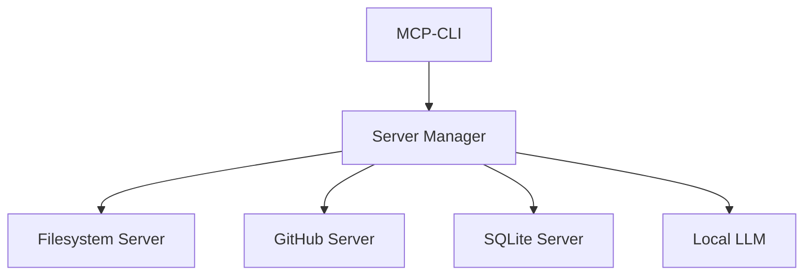

# Model Context Protocol (MCP) Implementation

## Overview
The Model Context Protocol (MCP) is an open standard for connecting AI assistants to data sources, content repositories, business tools, and development environments. This project implements an MCP-compatible CLI that enables interaction with multiple MCP servers while using local LLMs.

## Core Concepts

### MCP Architecture
- **MCP Servers**: Expose data through a standardized protocol
- **MCP Clients**: Connect to servers to access data and functionality
- **Two-way Communication**: Secure, bidirectional data flow
- **Universal Standard**: Replaces fragmented integrations with a single protocol

### Our Implementation

#### 1. Multi-Server Support
- Dynamic server discovery and connection
- Parallel server operations
- Server context switching
- Unified command routing

#### 2. Tool System
- Dynamic tool discovery from MCP servers
- JSON Schema-based tool definitions
- Runtime tool validation
- Parallel tool execution

#### 3. LLM Integration
- Local LLM support (Ollama)
- Context-aware responses
- Tool-aware prompting
- Streaming responses

## Server Integration

### Supported MCP Servers
1. **File System Server** (`@modelcontextprotocol/server-filesystem`)
   - Local file access
   - File operations
   - Directory management

2. **GitHub Server** (`@modelcontextprotocol/server-github`)
   - Repository access
   - Code search
   - PR management

3. **SQLite Server** (`mcp-server-sqlite`)
   - Database operations
   - Query execution
   - Schema management

### Server Communication


## Tool Protocol

### Tool Schema
Tools are defined using a standardized schema:
```json
{
    "name": "string",
    "description": "string",
    "parameters": [
        {
            "name": "string",
            "description": "string",
            "type": "string",
            "required": boolean
        }
    ],
    "returns": {
        "type": "string",
        "description": "string"
    }
}
```

### Tool Discovery
1. Server Connection
2. Tool Registration
3. Schema Validation
4. Dynamic Updates

## LLM Integration

### Local LLM Support
- Primary: Ollama with various models
- Fallback: Remote API options

### Context Management
- Server state tracking
- Tool availability awareness
- Response streaming
- Error handling

## Security Considerations

### Server Authentication
- Secure connection establishment
- Token-based auth where needed
- Local server validation

### Data Privacy
- Local-first approach
- Configurable data access
- Secure storage handling

## Development Guidelines

### Adding New Servers
1. Implement MCP server interface
2. Define tool schemas
3. Add connection handling
4. Update configuration

### Adding New Tools
1. Create tool schema
2. Implement tool logic
3. Add to server registration
4. Update documentation

## Future Enhancements

### Planned Features
1. Remote server support
2. Enhanced tool discovery
3. Advanced routing logic
4. Improved error handling

### Roadmap
1. Complete local server integration
2. Add comprehensive tool support
3. Enhance LLM context awareness
4. Implement advanced routing

## Resources
- [MCP Specification](https://modelcontextprotocol.io/specification)
- [MCP GitHub](https://github.com/anthropics/mcp)
- [Claude Desktop App](https://claude.ai/)
